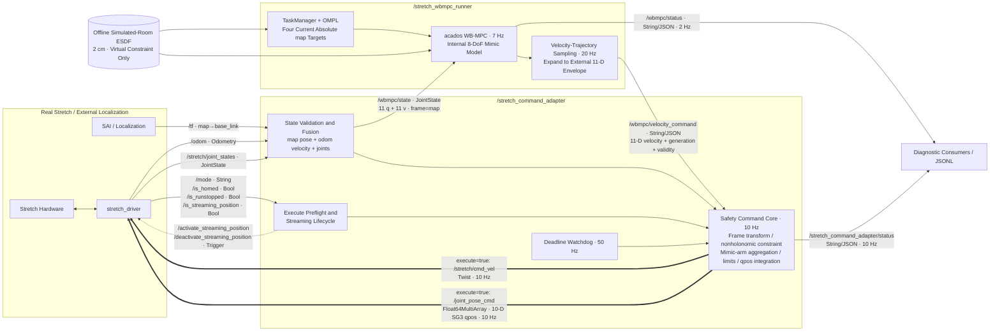
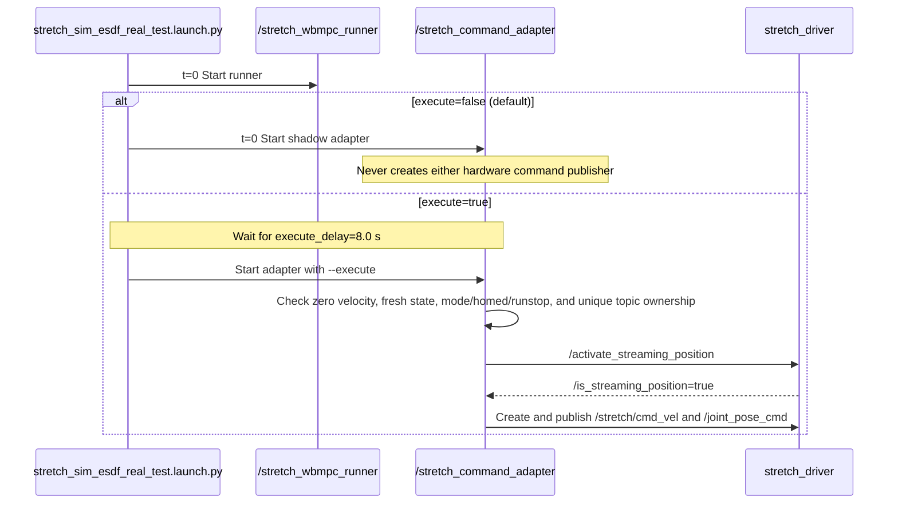

# Real Stretch Deployment Runbook

This is the final hardware-in-the-loop test interface.

Hardware procedure last validated: **2026-08-05**. Configuration and data-flow
documentation reviewed: **2026-08-11**.

This runbook is split into two stages:

1. bring up the robot, capture a real ESDF, and validate the exported map;
2. run the offline-ESDF WB-MPC stack in shadow or explicitly enabled mode.

Unless stated otherwise, each command block runs in a separate terminal. Do
not replace a process that must remain running in the same terminal.

## Safety and Fixed Environment

| Item                     | Current value                                                                  |
| ------------------------ | ------------------------------------------------------------------------------ |
| Robot SSH                | `hello-robot@192.168.50.173`                                                 |
| Robot repository         | `~/repos/bringup_active_mapmaintenance/online_bringup_active_mapmaintenance` |
| PC ROS/Zenoh environment | `~/repo/bringup_active_mapmaintenance/perceive_semantix`                     |
| PC algorithm repository  | `~/repo/mobile_manipulation`                                                 |
| rosbag root              | `/home/miao/data/real_stretch_esdf_bags`                                     |
| ROS middleware           | `rmw_zenoh_cpp`                                                              |

Mandatory safety rules:

- Clear the physical workspace and keep the runstop immediately accessible.
- Never run the normal Stretch launch and `launch-teleop` simultaneously.
- Allow exactly one base-command source during ESDF capture. Do not run Nav2,
  an old MPC process, or another teleop source at the same time.
- Start rosbag recording before motion. Stop the robot before stopping rosbag.
- Never store an SSH password in this repository; use an SSH key or an
  interactive prompt.
- The virtual ESDF is not a physical safety sensor.

## Part I — Robot Bringup and Real ESDF Capture

### 1. Start ROS and the Robot

#### R1 — Robot Zenoh

```bash
ping 192.168.50.173
ssh hello-robot@192.168.50.173
cd ~/repos/bringup_active_mapmaintenance/online_bringup_active_mapmaintenance
export RMW_IMPLEMENTATION=rmw_zenoh_cpp
pixi run -e zenoh launch
```

#### P1 — PC Zenoh Router

```bash
cd ~/repo/bringup_active_mapmaintenance/perceive_semantix
pixi shell -e zenoh
export RMW_IMPLEMENTATION=rmw_zenoh_cpp
RUST_LOG=zenoh=info ros2 run rmw_zenoh_cpp rmw_zenohd
```

#### R2 — Stretch Driver: Select Exactly One Mode

Use normal mode for read-only checks and homing:

```bash
ssh hello-robot@192.168.50.173
cd ~/repos/bringup_active_mapmaintenance/online_bringup_active_mapmaintenance
export RMW_IMPLEMENTATION=rmw_zenoh_cpp
pixi run -e stretch-ros2-zenoh launch
```

Use gamepad mode for teleoperated ESDF capture:

```bash
ssh hello-robot@192.168.50.173
cd ~/repos/bringup_active_mapmaintenance/online_bringup_active_mapmaintenance
export RMW_IMPLEMENTATION=rmw_zenoh_cpp
pixi run -e stretch-ros2-zenoh launch-teleop
```

Before switching modes, fully stop the previous launch with `Ctrl-C`.
`launch-teleop` starts `stretch_ps4_control`, which subscribes to the PC's
`/joy` and publishes `/gamepad_joy` to the Stretch driver.

#### R3 — SAI/Orbbec SLAM

Keep this process running in both normal and teleop modes:

```bash
ssh hello-robot@192.168.50.173
cd ~/repos/bringup_active_mapmaintenance/online_bringup_active_mapmaintenance
export RMW_IMPLEMENTATION=rmw_zenoh_cpp
pixi run -e ros2-orbbec-slam-zenoh launch
```

#### P2 — PC ROS Operations

```bash
cd ~/repo/bringup_active_mapmaintenance/perceive_semantix
pixi shell -e zenoh
export RMW_IMPLEMENTATION=rmw_zenoh_cpp
```

With the normal driver running, home the robot from P2:

```bash
ros2 node list
ros2 service call /home_the_robot std_srvs/srv/Trigger
```

If teleop capture follows, stop the normal driver after homing and restart R2
in `launch-teleop` mode.

### 2. Start and Verify PS4 Teleoperation

Connect the PS4 controller to the PC and confirm the device exists:

```bash
ls -l /dev/input/js0
```

In P3, start the joystick publisher:

```bash
cd ~/repo/bringup_active_mapmaintenance/perceive_semantix
pixi shell -e zenoh
export RMW_IMPLEMENTATION=rmw_zenoh_cpp
ros2 run joy joy_node --ros-args \
  -r __node:=pc_joy_node \
  -p device_id:=0 \
  -p deadzone:=0.1 \
  -p autorepeat_rate:=20.0
```

The verified communication chain is:

```text
PC /dev/input/js0
  -> /joy (Zenoh)
  -> robot stretch_ps4_control
  -> /gamepad_joy
  -> Stretch driver (gamepad mode)
```

Verify the chain in P2:

```bash
ros2 topic echo /mode --once
ros2 topic hz /joy
ros2 topic echo /gamepad_joy --once
```

`/mode` must report `gamepad`. Stop `ros2 topic hz` with `Ctrl-C` after a stable
rate is visible.

### 3. Validate ESDF Sensor Inputs

In P2, require actual depth, calibration, and localization messages:

```bash
ros2 topic info -v /spectacular_ai/depth_image

timeout 15s ros2 topic echo \
  /spectacular_ai/depth_image \
  --field header \
  --once

timeout 15s ros2 topic echo \
  /spectacular_ai/camera_info \
  --field header \
  --once

timeout 15s ros2 run tf2_ros tf2_echo \
  map camera_color_optical_frame
```

Pass criteria:

- the depth frame is `camera_color_optical_frame`;
- depth, CameraInfo, and `map -> camera_color_optical_frame` are available;
- `/mode` is `gamepad`;
- exactly one Stretch driver launch is running in R2.

SAI depth is a low-rate keyframe stream, not a 30 Hz raw stream. If no new
frame arrives briefly, move the viewpoint slightly before diagnosing failure.
Publisher endpoint presence alone does not prove continuous image delivery.

### 4. Record the Real ESDF Rosbag

In a new PC Zenoh shell (P4), choose a new `ESDF_BAG_NAME` for every capture:

```bash
cd ~/repo/bringup_active_mapmaintenance/perceive_semantix
pixi shell -e zenoh
export RMW_IMPLEMENTATION=rmw_zenoh_cpp

ESDF_BAG_ROOT=/home/miao/data/real_stretch_esdf_bags
ESDF_BAG_NAME="$(date +%F_%H-%M-%S)_esdf_scan"
mkdir -p "$ESDF_BAG_ROOT"

ros2 bag record \
  -o "$ESDF_BAG_ROOT/$ESDF_BAG_NAME" \
  /mode \
  /stretch/joint_states \
  /odom \
  /tf \
  /tf_static \
  /spectacular_ai/camera_info \
  /spectacular_ai/depth_image \
  /spectacular_ai/color_image \
  /spectacular_ai/map
```

This topic set matches the successful `2026-08-05_stage0_motion_01` capture.
Append `/joy /gamepad_joy` when a teleop-input audit is also required.

Begin moving only after the recorder has subscribed. Recommended capture path:

1. rotate slowly in place to observe all directions;
2. make small forward/backward translations to add parallax;
3. move head pan/tilt slowly to cover the floor, table, and obstacle edges;
4. pause at key viewpoints to allow SAI keyframe publication;
5. remain clear of people, glass, mirrors, and uncleared areas.

At the end, center the controller and verify the robot has stopped before
pressing `Ctrl-C` in P4. Then validate the bag:

```bash
ros2 bag info "$ESDF_BAG_ROOT/$ESDF_BAG_NAME"
```

Require nonzero counts for `/spectacular_ai/depth_image`,
`/spectacular_ai/camera_info`, `/tf`, `/tf_static`, `/stretch/joint_states`, and
`/odom`.

### 5. Export and Inspect the ESDF

Offline conversion requires an NVIDIA GPU on the PC:

```bash
cd ~/repo/mobile_manipulation

pixi run python mm_run/scripts/export_real_rosbag_esdf.py \
  /home/miao/data/real_stretch_esdf_bags/REPLACE_WITH_BAG_NAME \
  -o mm_run/results/nvblox_esdf/real_bag/REPLACE_WITH_BAG_NAME \
  --bounds XMIN YMIN ZMIN XMAX YMAX ZMAX \
  --voxel-size 0.05 \
  --grid-resolution 0.05 \
  --ground-min-z 0.08
```

Choose `--bounds` from the bag's `map`-frame depth endpoints, adding at least
0.30–0.50 m on every side. Do not reuse another bag's bounds blindly. Validated
examples:

```text
2026-08-05_stage0_motion_01: -4.2 -4.2 -0.2 4.2 4.2 2.2
2026-08-05_stage0_motion_02: -4.2 -5.9 -0.2 5.7 4.2 4.0
```

After export, check whether any `|distance| <= surface_band` points touch the
outermost three voxel layers. Expand those bounds and re-export if they do.
Bounds must also cover the planner's full `bounds_xy`; out-of-bounds queries are
correctly invalid but can unintentionally shrink the planning region.

The dual-map ground-handling export produces:

```text
esdf_grid.npz
map.nvblox
observed_space.nvblox
metadata.json
esdf_surface_preview.png
esdf_surface_band.ply
slices/
```

Check the final `known`, `valid`, and `start_valid` values. Never pass a map
with `start_valid=False` to OMPL/WB-MPC.

Interactive PyBullet inspection:

```bash
pixi run python mm_run/scripts/visualize_esdf_npz.py \
  mm_run/results/nvblox_esdf/real_bag/REPLACE_WITH_BAG_NAME/esdf_grid.npz \
  --surface-band 0.08 \
  --color-mode height
```

Use `--color-mode distance` to inspect the ESDF sign. Press `Q` to close the
viewer. Open the static preview with:

```bash
xdg-open \
  mm_run/results/nvblox_esdf/real_bag/REPLACE_WITH_BAG_NAME/esdf_surface_preview.png
```

### 6. Capture Shutdown Order

1. Center the gamepad and verify that the robot has stopped.
2. P4: stop rosbag with `Ctrl-C`, then run `ros2 bag info`.
3. P3: stop `joy_node` with `Ctrl-C`.
4. R3: stop SAI/Orbbec SLAM with `Ctrl-C`.
5. R2: stop the Stretch driver/teleop with `Ctrl-C`.
6. Stop P1 and R1 Zenoh last.

In an emergency, trigger runstop first. Never delay stopping motion to preserve
a rosbag.

### 7. Current Capture Limitations

- `depth_scale=0.001 m/unit` has not been independently frozen against a known
  distance.
- The real converter has map-Z ground filtering and dual-map observed-space
  handling, but no robot self-mask yet.
- SAI depth is a low-rate keyframe stream; complete coverage requires base
  translation and head pan/tilt scanning.
- The current offline ESDF is suitable for interface, geometry, and
  planner-validity checks. It does not by itself authorize real WB-MPC output.

## Part II — Simulated-ESDF WB-MPC on the Real Robot

### Test Task Sequence

The test uses the absolute `map`-frame targets from the merged `planner.tasks`
configuration in `stretch_esdf_sim_real_commissioning.yaml`. The short-distance
test targets in the commissioning overlay are currently commented out, so the
deployment inherits these four tasks from
`stretch_esdf_offline_ompl_wbmpc.yaml`:

1. `OMPL Base Work Area`: `base_pose: [2.0, 0.0, 0.0]`
2. `EE Approach`: `ee_pose: [3.0, -0.5, 0.9, 0.0, 0.0, -0.0708]`
3. `EE Reach Low`: `ee_pose: [3.0, -0.5, 0.4, 0.0, 0.0, -0.0708]`
4. `EE Reach Side`: `ee_pose: [3.0, 0.5, 0.4, 0.0, 0.0, -0.0708]`

The launch defaults to shadow mode. Hardware command publishers are created
only when `execute:=true` is set explicitly, the runner has initialized for 8
seconds, and the adapter has passed its zero-command preflight.

### ROS Nodes and Data Flow

The node and topic names below come from
`stretch_sim_esdf_real_test.launch.py`, `stretch_command_adapter_real.yaml`,
and `stretch_wbmpc_sim_esdf_real_test.yaml`.

#### Complete Closed Loop



Solid lines carry feedback or internal control data. Double lines are hardware
command channels that exist only with `execute=true`, and the dashed line shows
service calls. `/wbmpc/status` is diagnostic output, not a safety input to the
adapter. The adapter applies its watchdog directly to the absolute validity
deadline carried by the `/wbmpc/velocity_command` envelope.

#### Launch Sequence and Modes



#### Topic and Service Reference

| Name                                | Type                               | Publisher → Subscriber           | Current purpose                                                           |
| ----------------------------------- | ---------------------------------- | --------------------------------- | ------------------------------------------------------------------------- |
| `/tf` (`map→base_link`)        | `tf2_msgs/msg/TFMessage`         | localization → adapter TF buffer | Supplies the global base-pose anchor                                      |
| `/odom`                           | `nav_msgs/msg/Odometry`          | driver → adapter                 | Propagates the base pose and supplies body twist                          |
| `/stretch/joint_states`           | `sensor_msgs/msg/JointState`     | driver → adapter                 | Arm feedback; preserves the four extension segments as independent states |
| `/mode`                           | `std_msgs/msg/String`            | driver → adapter                 | Must be`navigation`                                                     |
| `/is_homed`                       | `std_msgs/msg/Bool`              | driver → adapter                 | Must be`true`                                                           |
| `/is_runstopped`                  | `std_msgs/msg/Bool`              | driver → adapter                 | Must be`false`                                                          |
| `/is_streaming_position`          | `std_msgs/msg/Bool`              | driver → adapter                 | Closed-loop confirmation of streaming mode                                |
| `/wbmpc/state`                    | `sensor_msgs/msg/JointState`     | adapter → runner                 | 11-D`q/v`, with `frame_id=map`                                        |
| `/wbmpc/velocity_command`         | `std_msgs/msg/String`            | runner → adapter                 | 11-D target-velocity JSON envelope at 20 Hz                               |
| `/wbmpc/status`                   | `std_msgs/msg/String`            | runner → diagnostics             | Solver, task, and ESDF status at 2 Hz                                     |
| `/stretch_command_adapter/status` | `std_msgs/msg/String`            | adapter → diagnostics            | `shadow/wbmpc/hold/latched` state and limiting reasons at 10 Hz         |
| `/stretch/cmd_vel`                | `geometry_msgs/msg/Twist`        | adapter → driver                 | Execute only; base`vx` and `wz`, with `vy=0`, at 10 Hz              |
| `/joint_pose_cmd`                 | `std_msgs/msg/Float64MultiArray` | adapter → driver                 | Execute only; 10-D SG3 streaming qpos at 10 Hz                            |
| `/activate_streaming_position`    | `std_srvs/srv/Trigger`           | adapter → driver                 | Enables position streaming after preflight                                |
| `/deactivate_streaming_position`  | `std_srvs/srv/Trigger`           | adapter → driver                 | Disables position streaming on latch or exit                              |

#### Ordering of the Two 11-D Interfaces

`/wbmpc/state` and `/wbmpc/velocity_command.velocity` use this order:

```text
[x_map, y_map, yaw_map,
 lift,
 arm_l3, arm_l2, arm_l1, arm_l0,
 wrist_yaw, wrist_pitch, wrist_roll]
```

Internally, the runner collapses the four arm mimic segments into one
`joint_arm_l3` coordinate and solves with an 8-DoF model. It then expands the
result back to 11-D for the adapter. `/joint_pose_cmd.data` instead follows the
10-D Stretch SG3 order:

```text
[wrist_extension, lift, wrist_yaw, wrist_pitch, wrist_roll,
 head_pan, head_tilt, gripper_left,
 base_translate_increment, base_rotate_increment]
```

The adapter currently controls only the first five position channels. Head and
gripper positions retain their measured values, while the last two base
increments remain zero. Base motion is sent separately through
`/stretch/cmd_vel`.

The ESDF branch constrains OMPL and WB-MPC mathematically; it does not observe
the physical room. The adapter is the only node allowed to create the two
hardware command publishers. Those publisher branches do not exist in shadow
mode.

Both current runner profiles set `forward_prediction.enabled: false`.
Therefore, each 7 Hz control cycle solves directly from the latest fused state,
without forward prediction for state age, solver time, or dispatch latency. If
execution exceeds `solver_deadline: 0.12 s`, the adapter enters a soft hold
according to the previous envelope's absolute validity deadline while the
solver continues. Because `accept_late_results: true`, a late non-fallback
result resets the plan origin to its completion time and releases the hold
through a new envelope.

### 1. Build

```bash
cd /home/miao/repo/mobile_manipulation
pixi run colcon build --packages-select mm_control mm_run
pixi run bash -lc 'source install/setup.bash; python3 mm_control/scripts/generate_acados_code.py --config $(ros2 pkg prefix mm_run)/share/mm_run/config/stretch_esdf_sim_real_commissioning.yaml'
```

The second command is required after changing MPC costs or constraints, or
after recreating `install/mm_control`. It generates the runtime
`acados_ocp_StretchESDFMimic.json`, Cython module, and shared library.

### 2. Read-Only Real-Robot Preflight

Run these commands in the existing Zenoh environment:

```bash
cd /home/miao/repo/bringup_active_mapmaintenance/perceive_semantix
pixi run -e zenoh env RMW_IMPLEMENTATION=rmw_zenoh_cpp ROS_LOG_DIR=/tmp/mm_real_test_preflight ros2 topic echo --once /mode
pixi run -e zenoh env RMW_IMPLEMENTATION=rmw_zenoh_cpp ROS_LOG_DIR=/tmp/mm_real_test_preflight ros2 topic echo --once /is_homed
pixi run -e zenoh env RMW_IMPLEMENTATION=rmw_zenoh_cpp ROS_LOG_DIR=/tmp/mm_real_test_preflight ros2 topic echo --once /is_runstopped
pixi run -e zenoh env RMW_IMPLEMENTATION=rmw_zenoh_cpp ROS_LOG_DIR=/tmp/mm_real_test_preflight ros2 topic echo --once /is_streaming_position
pixi run -e zenoh env RMW_IMPLEMENTATION=rmw_zenoh_cpp ROS_LOG_DIR=/tmp/mm_real_test_preflight ros2 topic info /stretch/cmd_vel
pixi run -e zenoh env RMW_IMPLEMENTATION=rmw_zenoh_cpp ROS_LOG_DIR=/tmp/mm_real_test_preflight ros2 topic info /joint_pose_cmd
```

Every startup must satisfy:

```text
mode=navigation
homed=true
runstopped=false
streaming_position=false
/stretch/cmd_vel publisher count=0
/joint_pose_cmd publisher count=0
```

Place the robot in an open physical area, wait for the SAI
`map -> base_link` TF to stabilize, and then check the pose. The center of the
simulated test room is empty. Keep the starting point inside the ESDF bounds
`x/y=[-4.2, 4.2]` with sufficient margin:

```bash
pixi run -e zenoh env RMW_IMPLEMENTATION=rmw_zenoh_cpp ROS_LOG_DIR=/tmp/mm_real_test_tf ros2 run tf2_ros tf2_echo map base_link
```

### 3. Combined Shadow Test

This command does not pass `--execute` to the adapter:

```bash
cd /home/miao/repo/mobile_manipulation
pixi run bash -lc 'export RMW_IMPLEMENTATION=rmw_zenoh_cpp; export ROS_LOG_DIR=/tmp/mm_sim_esdf_shadow_ros; export MPLCONFIGDIR=/tmp/mm_sim_esdf_shadow_mpl; export AMENT_PREFIX_PATH=/home/miao/repo/bringup_active_mapmaintenance/perceive_semantix/.pixi/envs/zenoh:$AMENT_PREFIX_PATH; export LD_LIBRARY_PATH=/home/miao/repo/bringup_active_mapmaintenance/perceive_semantix/.pixi/envs/zenoh/lib:$LD_LIBRARY_PATH; source install/setup.bash; ros2 launch mm_run stretch_sim_esdf_real_test.launch.py execute:=false adapter_log:=/tmp/stretch_sim_esdf_adapter_shadow.jsonl wbmpc_log:=/tmp/stretch_sim_esdf_wbmpc_shadow.jsonl'
```

Allow the first absolute-target task to plan and solve for at least 20 seconds,
then press `Ctrl-C`. The physical robot does not move in shadow mode, so the
state will not reach the first goal and the task manager will not advance to
later tasks. Check the solver and simulated-ESDF queries:

```bash
jq -s '{solver_records:(map(select(.record_type=="solver"))|length), statuses:(map(select(.record_type=="solver")|.solver_status)|unique), max_failures:(map(select(.record_type=="solver")|.solver_failure_count)|max), max_fallbacks:(map(select(.record_type=="solver")|.solver_fallback_count)|max), deadline_misses:(map(select(.record_type=="solver" and .deadline_missed==true))|length), prediction_clips:(map(select(.record_type=="solver" and (.prediction_input_clipped==true or .prediction_state_clipped==true)))|length), tasks:(map(select(.record_type=="solver")|.task_name)|unique)}' /tmp/stretch_sim_esdf_wbmpc_shadow.jsonl
jq -s '{records:length, enabled:(map(select(.wbmpc_enabled==true))|length), max_abs_base:(map(.base_linear_x|fabs)|max), max_abs_yaw:(map(.base_angular_z|fabs)|max)}' /tmp/stretch_sim_esdf_adapter_shadow.jsonl
```

A stable shadow interval requires `statuses=[0]`, `max_failures=0`,
`max_fallbacks=0`, `deadline_misses=0`, `prediction_clips=0`, and `enabled=0`.
Commands must be finite and remain within the effective model and driver
limits. A deadline hold is expected safety behavior if the initial OMPL solve
or replanning exceeds 120 ms. The old envelope expires and triggers a hold
first; a late non-fallback result receives a new validity interval based on its
completion time before being published.

### 4. Combined Real-Robot Test

Place the robot in an open physical area. Ensure that people and movable
objects cannot enter the full test region, and keep the runstop/E-stop within
immediate reach. The virtual ESDF is not a physical safety sensor.

```bash
cd /home/miao/repo/mobile_manipulation
pixi run bash -lc 'export RMW_IMPLEMENTATION=rmw_zenoh_cpp; export ROS_LOG_DIR=/tmp/mm_sim_esdf_execute_ros; export MPLCONFIGDIR=/tmp/mm_sim_esdf_execute_mpl; export AMENT_PREFIX_PATH=/home/miao/repo/bringup_active_mapmaintenance/perceive_semantix/.pixi/envs/zenoh:$AMENT_PREFIX_PATH; export LD_LIBRARY_PATH=/home/miao/repo/bringup_active_mapmaintenance/perceive_semantix/.pixi/envs/zenoh/lib:$LD_LIBRARY_PATH; source install/setup.bash; ros2 launch mm_run stretch_sim_esdf_real_test.launch.py execute:=true execute_delay:=8.0 adapter_log:=/tmp/stretch_sim_esdf_adapter_execute.jsonl wbmpc_log:=/tmp/stretch_sim_esdf_wbmpc_execute.jsonl'
```

The runner starts first and publishes only the internal WB-MPC command topic.
After 8 seconds, the adapter completes its zero-command, state, device-status,
streaming, and unique-command-owner preflight before creating the hardware
publishers. Press `Ctrl-C` to stop at any time. Before ROS shuts down, the
adapter sends five zero-command/position-hold samples and disables
streaming-position mode.

After the run, generate comparison plots for commands, joints, raw `/odom`, raw
`map -> base_link` TF, and the fused adapter state:

```bash
cd /home/miao/repo/mobile_manipulation
pixi run python mm_run/scripts/plot_real_command_state.py \
  --wbmpc-log /tmp/stretch_sim_esdf_wbmpc_execute.jsonl \
  --adapter-log /tmp/stretch_sim_esdf_adapter_execute.jsonl \
  --output-dir results/diagnostics/command_state
```

The localization comparison plot is written to
`results/diagnostics/command_state/base_localization_state.png`.

If `/stretch_command_adapter/status` reports `state: hold`, inspect
`soft_hold_reason` first. Solver overrun, fallback, or plan expiration causes a
recoverable soft hold. Only `state: latched` requires stopping the process,
investigating the hard fault, and repeating preflight.

### 5. Mandatory Shutdown Check

```bash
cd /home/miao/repo/bringup_active_mapmaintenance/perceive_semantix
pixi run -e zenoh env RMW_IMPLEMENTATION=rmw_zenoh_cpp ROS_LOG_DIR=/tmp/mm_real_test_cleanup ros2 topic echo --once /mode
pixi run -e zenoh env RMW_IMPLEMENTATION=rmw_zenoh_cpp ROS_LOG_DIR=/tmp/mm_real_test_cleanup ros2 topic echo --once /is_streaming_position
pixi run -e zenoh env RMW_IMPLEMENTATION=rmw_zenoh_cpp ROS_LOG_DIR=/tmp/mm_real_test_cleanup ros2 topic info /stretch/cmd_vel
pixi run -e zenoh env RMW_IMPLEMENTATION=rmw_zenoh_cpp ROS_LOG_DIR=/tmp/mm_real_test_cleanup ros2 topic info /joint_pose_cmd
```

The final state must satisfy:

```text
mode=navigation
streaming_position=false
/stretch/cmd_vel publisher count=0
/joint_pose_cmd publisher count=0
```
