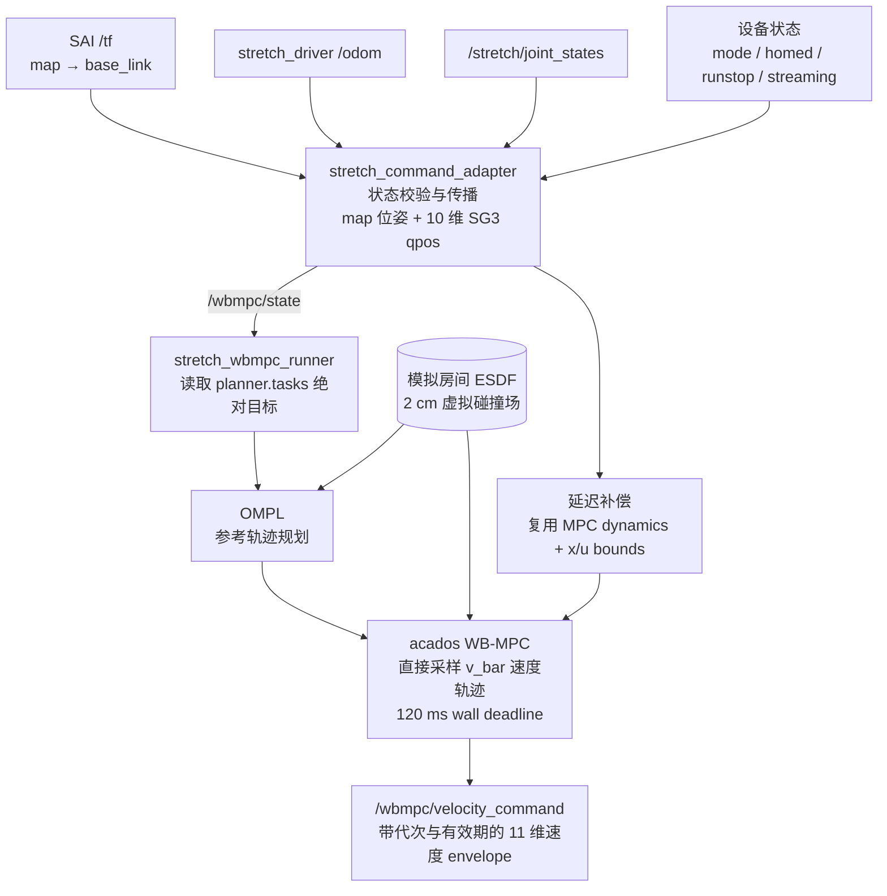
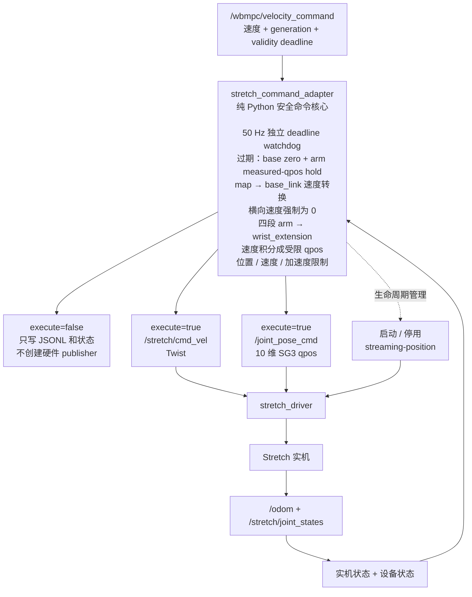

# Stretch 模拟 ESDF 接入实机部署

这是最终的硬件在环测试接口：控制器使用完整的模拟测试房间 ESDF，状态输入与
命令输出均连接真实 Stretch。模拟地图**无法检测实机周围的物理障碍物**。

## 测试任务序列

测试直接使用 `stretch_esdf_sim_real_commissioning.yaml` 合并后的
`planner.tasks` 绝对 `map` 坐标目标。当前 commissioning 目标为：底盘到达
`base_pose: [1.0, 0.0, 0.0]`。

launch 默认为 shadow。只有显式设置 `execute:=true`，等待 runner 初始化 8 秒且
adapter 通过零命令预检后，才会创建硬件命令 publisher。

## ROS 节点与数据流

### 1. 状态、规划与 WB-MPC



### 2. 安全适配与实机输出



ESDF 分支只在数学上约束规划和 MPC，并不观测真实房间。adapter 是唯一允许创建
两个硬件命令 publisher 的节点；shadow 模式下这两条 publisher 分支根本不存在。

每个 7 Hz 控制周期按“状态源年龄 + 自适应预计计算时间 + adapter 派发延迟”前向
预测。预测直接调用 controller robot 的 `fmdlk` 和 acados 所用的
`lb_x/ub_x/lb_u/ub_u`，不会额外扫描整张 ESDF。求解完成后立即发布，不再等待预测
时长。超过 `solver_deadline: 0.12 s` 时，adapter 根据上一条 envelope 的绝对
有效期自行进入软 hold；求解器继续运行，完成后的非 fallback 解会以完成时刻作为
新的 plan origin 下发并解除 hold。

## 1. 构建

```bash
cd /home/miao/repo/mobile_manipulation
pixi run colcon build --packages-select mm_control mm_run
pixi run bash -lc 'source install/setup.bash; python3 mm_control/scripts/generate_acados_code.py --config $(ros2 pkg prefix mm_run)/share/mm_run/config/stretch_esdf_sim_real_commissioning.yaml'
```

第二条命令必须在修改 MPC 代价、约束或重新创建 `install/mm_control` 后执行。它会
生成运行时所需的 `acados_ocp_StretchESDFMimic.json`、Cython 模块和动态库。

## 2. 实机只读预检

在现有 Zenoh 环境中执行：

```bash
cd /home/miao/repo/bringup_active_mapmaintenance/perceive_semantix
pixi run -e zenoh env RMW_IMPLEMENTATION=rmw_zenoh_cpp ROS_LOG_DIR=/tmp/mm_real_test_preflight ros2 topic echo --once /mode
pixi run -e zenoh env RMW_IMPLEMENTATION=rmw_zenoh_cpp ROS_LOG_DIR=/tmp/mm_real_test_preflight ros2 topic echo --once /is_homed
pixi run -e zenoh env RMW_IMPLEMENTATION=rmw_zenoh_cpp ROS_LOG_DIR=/tmp/mm_real_test_preflight ros2 topic echo --once /is_runstopped
pixi run -e zenoh env RMW_IMPLEMENTATION=rmw_zenoh_cpp ROS_LOG_DIR=/tmp/mm_real_test_preflight ros2 topic echo --once /is_streaming_position
pixi run -e zenoh env RMW_IMPLEMENTATION=rmw_zenoh_cpp ROS_LOG_DIR=/tmp/mm_real_test_preflight ros2 topic info /stretch/cmd_vel
pixi run -e zenoh env RMW_IMPLEMENTATION=rmw_zenoh_cpp ROS_LOG_DIR=/tmp/mm_real_test_preflight ros2 topic info /joint_pose_cmd
```

每次启动前必须满足：

```text
mode=navigation
homed=true
runstopped=false
streaming_position=false
/stretch/cmd_vel publisher count=0
/joint_pose_cmd publisher count=0
```

把机器人放到空地后，等待 SAI 的 `map -> base_link` TF 稳定，再检查位姿。模拟测试房间中心为空，
起点应留在 ESDF 边界 `x/y=[-4.2, 4.2]` 内并保持足够余量：

```bash
pixi run -e zenoh env RMW_IMPLEMENTATION=rmw_zenoh_cpp ROS_LOG_DIR=/tmp/mm_real_test_tf ros2 run tf2_ros tf2_echo map base_link
```

## 3. 组合 shadow 测试

这条命令不会向 adapter 传递 `--execute`：

```bash
cd /home/miao/repo/mobile_manipulation
pixi run bash -lc 'export RMW_IMPLEMENTATION=rmw_zenoh_cpp; export ROS_LOG_DIR=/tmp/mm_sim_esdf_shadow_ros; export MPLCONFIGDIR=/tmp/mm_sim_esdf_shadow_mpl; export AMENT_PREFIX_PATH=/home/miao/repo/bringup_active_mapmaintenance/perceive_semantix/.pixi/envs/zenoh:$AMENT_PREFIX_PATH; export LD_LIBRARY_PATH=/home/miao/repo/bringup_active_mapmaintenance/perceive_semantix/.pixi/envs/zenoh/lib:$LD_LIBRARY_PATH; source install/setup.bash; ros2 launch mm_run stretch_sim_esdf_real_test.launch.py execute:=false adapter_log:=/tmp/stretch_sim_esdf_adapter_shadow.jsonl wbmpc_log:=/tmp/stretch_sim_esdf_wbmpc_shadow.jsonl'
```

让第一个绝对目标任务规划并求解至少 20 秒，然后按 `Ctrl-C`。实机在 shadow 模式下
不会移动，因此状态不会到达第一个目标，任务管理器也不会推进到后续任务。检查
求解器和模拟 ESDF 查询：

```bash
jq -s '{solver_records:(map(select(.record_type=="solver"))|length), statuses:(map(select(.record_type=="solver")|.solver_status)|unique), max_failures:(map(select(.record_type=="solver")|.solver_failure_count)|max), max_fallbacks:(map(select(.record_type=="solver")|.solver_fallback_count)|max), deadline_misses:(map(select(.record_type=="solver" and .deadline_missed==true))|length), prediction_clips:(map(select(.record_type=="solver" and (.prediction_input_clipped==true or .prediction_state_clipped==true)))|length), tasks:(map(select(.record_type=="solver")|.task_name)|unique)}' /tmp/stretch_sim_esdf_wbmpc_shadow.jsonl
jq -s '{records:length, enabled:(map(select(.wbmpc_enabled==true))|length), max_abs_base:(map(.base_linear_x|fabs)|max), max_abs_yaw:(map(.base_angular_z|fabs)|max)}' /tmp/stretch_sim_esdf_adapter_shadow.jsonl
```

shadow 正常稳定段要求：`statuses=[0]`、`max_failures=0`、`max_fallbacks=0`、
`deadline_misses=0`、`prediction_clips=0`、`enabled=0`，且命令为有限值并处于
model/driver 有效限制内。首次 OMPL 或重规划超过 120 ms 时出现 deadline hold 是
预期安全行为；不能把迟到结果继续下发。

## 4. 实机组合测试

将机器人放在物理空地内，确保人员和可移动物体不进入完整测试范围，并保证随时能
触及 runstop/E-stop。虚拟 ESDF 不是物理安全传感器。

```bash
cd /home/miao/repo/mobile_manipulation
pixi run bash -lc 'export RMW_IMPLEMENTATION=rmw_zenoh_cpp; export ROS_LOG_DIR=/tmp/mm_sim_esdf_execute_ros; export MPLCONFIGDIR=/tmp/mm_sim_esdf_execute_mpl; export AMENT_PREFIX_PATH=/home/miao/repo/bringup_active_mapmaintenance/perceive_semantix/.pixi/envs/zenoh:$AMENT_PREFIX_PATH; export LD_LIBRARY_PATH=/home/miao/repo/bringup_active_mapmaintenance/perceive_semantix/.pixi/envs/zenoh/lib:$LD_LIBRARY_PATH; source install/setup.bash; ros2 launch mm_run stretch_sim_esdf_real_test.launch.py execute:=true execute_delay:=8.0 adapter_log:=/tmp/stretch_sim_esdf_adapter_execute.jsonl wbmpc_log:=/tmp/stretch_sim_esdf_wbmpc_execute.jsonl'
```

runner 先启动，只发布 WB-MPC 内部命令 topic。8 秒后，adapter 完成零命令、状态、
设备状态、streaming 和命令唯一所有者预检，随后才创建硬件 publisher。任何时候都
可按 `Ctrl-C` 停止；ROS 关闭前 adapter 会发送 5 次零命令/位置保持，并停用
streaming-position。

结束后生成命令、关节以及原始 `/odom`、原始 `map -> base_link` TF、adapter 融合状态
的对比图：

```bash
cd /home/miao/repo/mobile_manipulation
pixi run python mm_run/scripts/plot_real_command_state.py \
  --wbmpc-log /tmp/stretch_sim_esdf_wbmpc_execute.jsonl \
  --adapter-log /tmp/stretch_sim_esdf_adapter_execute.jsonl \
  --output-dir results/diagnostics/command_state
```

定位对比图为 `results/diagnostics/command_state/base_localization_state.png`。

运行中若 `/stretch_command_adapter/status` 显示 `state: hold`，先看
`soft_hold_reason`：solver overrun/fallback/plan expired 是可自动恢复的软 hold；
`state: latched` 才需要停止进程、排查硬故障并重新预检。

## 5. 强制收尾检查

```bash
cd /home/miao/repo/bringup_active_mapmaintenance/perceive_semantix
pixi run -e zenoh env RMW_IMPLEMENTATION=rmw_zenoh_cpp ROS_LOG_DIR=/tmp/mm_real_test_cleanup ros2 topic echo --once /mode
pixi run -e zenoh env RMW_IMPLEMENTATION=rmw_zenoh_cpp ROS_LOG_DIR=/tmp/mm_real_test_cleanup ros2 topic echo --once /is_streaming_position
pixi run -e zenoh env RMW_IMPLEMENTATION=rmw_zenoh_cpp ROS_LOG_DIR=/tmp/mm_real_test_cleanup ros2 topic info /stretch/cmd_vel
pixi run -e zenoh env RMW_IMPLEMENTATION=rmw_zenoh_cpp ROS_LOG_DIR=/tmp/mm_real_test_cleanup ros2 topic info /joint_pose_cmd
```

最终必须满足：

```text
mode=navigation
streaming_position=false
/stretch/cmd_vel publisher count=0
/joint_pose_cmd publisher count=0
```
